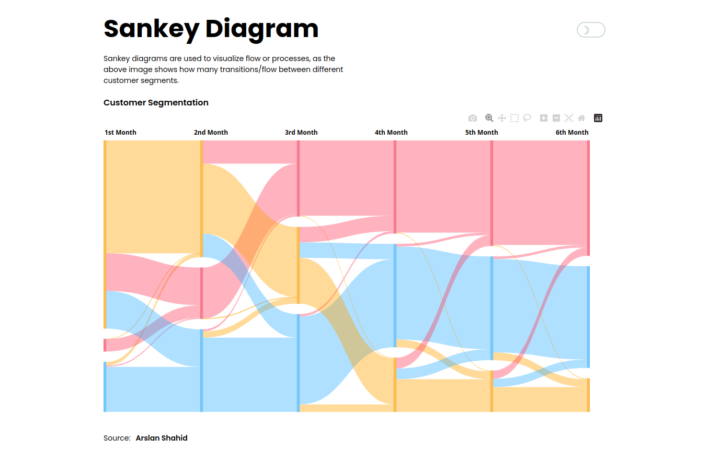

# Sankey diagram

Sankey diagrams are a specific type of flow diagram used for visualization of material, cost or energy flows.

Using Sankey diagrams you communicate your data effectively and get your message across: Whether it is to external stakeholders or within your project team.

- Visualization of material and energy flows
- Universally and versatilely deployable
- Width of the arrows is proportional to the flow quantity
- Named after the Irish engineer Captain Matthew H.R. Sankey (1853-1925)

To create this example, I used materials prepared by [Arslan Shahid](https://arslanshahid-1997.medium.com/sankeying-with-plotly-90500b87d8cf)
